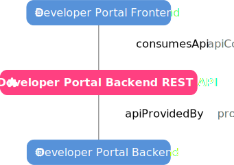

# Registering a Web App

## Preface

!!! example inline end "Example Developer Portal View"

    

This tutorial will take you through registration of a basic web application, producing a result like the example on the right. This app will comprise of four entities:

- A [Component](../explanations/component.md) for the Backend
- A [Component](../explanations/component.md) for the Frontend
- An [API](../explanations/api.md) produced by the Backend and consumed by the Frontend
- A [System](../explanations/system.md) which encompasses the whole app

## Create a Git Repository

To begin, we will create a new git repository. To do this we will:

1. Create a new directory with `mkdir`
2. Change into this new directory with `cd`
3. Intialize git with `git init`

Let's call our web app `my-web-app`, thus in a new bash terminal we will execute the following:

```bash
mkdir my-web-app
cd my-web-app
git init
```

## Create the Entity Descriptor File

We will begin by creating the entity descriptor file, in which all of the entity definitions will be placed. This file will be indexed by the developer portal [entity ingress process](../explanations/entity-ingress.md), thus it must be in the exact location defined for the Git [discovery locations](../references/discovery-locations.md).

!!! info "Discovery Locations"

    

```bash
touch catalog-info.yaml
```

With our favourite text editor we will then open this file and begin filling it out. The `nano` editor is considered rather beginner friendly, thus we will choose to use it. You can open the file we just created by executing:

```bash
nano system-info.yaml
```

## Create the System

The first entity we will create is a [System](../explanations/system.md), this will encompass the whole app. The following contents should be entered into the `catalog-info,yaml` file.

### System Entity Definition

!!! info

    A full description of the top level structure of an entity definition can be found in the [entity envelope reference](../references/entity-envelope.md).

Each entity definition must include an `apiVersion` and a `kind`. The `apiVersion` is used to track the version of the entity definition format that is being used, the current version is `backstage.io/v1alpha1` thus we will use this. The `kind` is used to specify the type of entity we are defining, for a software system we use `System`. Thus we will begin the definition with the following:

```yaml
apiVersion: backstage.io/v1alpha1
kind: System
```

### System Metadata

!!! info

    A full list of entity metadata fields can be found in the [entity metadata reference](../references/entity-metadata.md).

Each entity must be given some metadata, this is the same regardless of the entity `kind`, and will reside within the `metadata` object. Only a `name` is required, however we will choose to give the system a `title` and `description` as well. The `name` should be both human and machine readable, this it is required to be a globally unique string between 1 and 63 characters consisting of sequences of `[a-z0-9A-Z]` possibly separated by one of `[-_.]`, we will choose to call our system `my-web-app`. The `title` field is less restrictive, it should simply be a short human readable string, we will title our System `My Web App`. The `description` is similar, but should be longer, we will use it to briefly describe what our system is. Thus we will add the following lines to the definition:

```yaml
metadata:
  name: my-web-app
  title: My Web App
  description: A web application created by me, consisting of a backend and frontend connected by a REST API
```

### System Spec

!!! info

    A full list of system spec fields can be found in the [system spec reference](../references/system-spec.md).

Each entity must be given a spec, this is unique to each entity `kind`, and will reside within the `spec` object. For a System, only an `owner` is required, in this tutorial I will reference myself, `user:enu43627`, whilst you should use your own FedID in place of mine (`enu43627`).

```yaml
spec:
  owner: user:enu43627
```

??? example "Complete System Definition"

    ```yaml
    apiVersion: backstage.io/v1alpha1
    kind: System
    metadata:
      name: my-web-app
      title: My Web App
      description: A web application created by me, consisting of a backend and frontend connected by a REST API
    spec:
      owner: user:enu43627
    ```

## Create the Backend Component

We will now create a [Component](../explanations/component.md) for the Backend. We will append the following Component definition to the previous definition, with three dashes (`---`) seperating them.

### Backend Component Entity Definition

For a Component we must define the entity `kind` to be `component`. Thus we will begin the definition with the following:

```yaml
apiVersion: backstage.io/v1alpha1
kind: component
```

### Backend Component Metadata

We will `name` our backend component a `my-web-app-backend`, give it the `title` `My Web App Backend` and an `description` which will briefly describe what our component does. Thus we will add the following lines to the definition:

```yaml
metadata:
  name: my-web-app-backend
  title: My Web App Backend
  description: The backend service for My Web App, it provides an API with lots of useful data
```

### Backend Component Spec

!!! info

    A full list of component spec fields can be found in the [component spec reference](../references/component-spec.md).

Each entity must be given a spec, this is unique to each entity `kind`, and will reside within the `spec` object. For a Component, a `type`, `lifecycle`, and `owner` are required, in addition to these we will define `system` and `providesApis`. Whilst `type` may be any string there are a small number of [commonly used values](../references/common-component-types.md) which should be used, we will choose `service` to describe our Backend. The lifecycle may also be any string, but again there are a small number of [commonly used values](../references/common-lifecycle-stages.md) which should be used, we will choose `experimental`. Like with the [system spec](#system-spec), I will reference myself, `user:enu43627` as the user. The `system` field allows us to define the System this component belongs to, thus we will give it the same value as the `metadata.name` of our System. Similarly `providesApis` allows us to define a list of APIs which are exposed by our Backend Component, we will therefore make an entry with what will be the `metadata.name` of our API `my-web-app-rest`. Thus we will add the following lines to the definition:

```yaml
spec:
  type: service
  lifecycle: experimental
  owner: user:enu43627
  system: my-web-app
  providesApis:
    - my-web-app-rest
```

??? example "Complete Backend Component Definition"

    ```yaml
    apiVersion: backstage.io/v1alpha1
    kind: component
    metadata:
      name: my-web-app-backend
      title: My Web App Backend
      description: The backend service for My Web App, it magically works without any code
    spec:
      type: service
      lifecycle: experimental
      owner: user:enu43627
      system: my-web-app
      providesApis:
        - my-web-app-rest
    ```

## Create the API

We will now create an [API](../explanations/api.md) exposed by the Backend. We will append the following API definition to the previous definition, with three dashes (`---`) seperating them.

### API Entity Definition

For an API we must define the entity `kind` to be `API`. Thus we will begin the definition with the following:

```yaml
apiVersion: backstage.io/v1alpha1
kind: API
```

### API Metadata

We will `name` our backend API `my-web-app-rest`, give it the `title` `My Web App REST API` and an `description` which will briefly describe what our API exposes. Thus we will add the following lines to the definition:

```yaml
metadata:
  name: my-web-app-rest
  title: My Web App Backend
  description: The REST API for My Web App, it allows you to get lots of useful data
```

### API Spec

!!! info

    A full list of API spec fields can be found in the [API spec reference](../references/api-spec.md).

Each entity must be given a spec, this is unique to each entity kind, and will reside within the spec object. For an API, a `type`, `lifecycle`, `owner` and `definition` are required, in addition to these we will define a `system`. Whilst `type` may be any string there are a small number of [commonly used values](../references/common-api-types.md) which should be used, we will choose `openapi` as this is most appropriate for representing REST APIs. Similarly to the [backend component spec](#backend-component-spec) we will set the `lifecycle` to be `experimental`, the `owner` to be myself `user:enu43627`, and the `system` as the `metadata.name` of our System. The API `definition` should be a multi-line string in the format defined by the `type`, a minimal OpenAPI definition contains only a few fields and shall be used here, whilst a full definition should be used for real applications where available. Thus we will add the following lines to the definition:

```yaml
spec:
  type: openapi
  lifecycle: experimental
  owner: user:enu43627
  system: my-web-app
  definition: |
    openapi: 3.0.0
    info:
      title: My Web App REST API
      version: 0.0.1
```

??? example "Complete API Definition"

    ```yaml
    apiVersion: backstage.io/v1alpha1
    kind: API
    metadata:
      name: my-web-app-rest
      title: My Web App Backend
      description: The REST API for My Web App, it allows you to get lots of useful data
    spec:
      type: openapi
      lifecycle: experimental
      owner: user:enu43627
      system: my-web-app
      definition: |
        openapi: 3.0.0
        info:
          title: My Web App REST API
          version: 0.0.1
    ```

## Create the Frontend Component

We will now create a [Component](../explanations/component.md) for the Frontend. We will append the following Component definition to the previous definition, with three dashes (`---`) seperating them.

### Frontend Component Entity Definition

For a Component we must define the entity `kind` to be `component`. Thus we will begin the definition with the following:

```yaml
apiVersion: backstage.io/v1alpha1
kind: component
```

### Frontend Component Metadata

We will `name` our frontend component a `my-web-app-frontend`, give it the `title` `My Web App Frontend` and an `description` which will briefly describe what our component does. Thus we will add the following lines to the definition:

```yaml
metadata:
  name: my-web-app-frontend
  title: My Web App Frontend
  description: The frontend website for My Web App, it consumes an API and displays data to users
```

### Frontend Component Spec

Each entity must be given a spec, this is unique to each entity `kind`, and will reside within the `spec` object. For a Component, a `type`, `lifecycle`, and `owner` are required, in addition to these we will define `system` and `consumesApis`. Whilst `type` may be any string there are a small number of [commonly used values](../references/common-component-types.md) which should be used, we will choose `website` to describe our Frontend. Similarly to the [backend component spec](#backend-component-spec) we will set the `lifecycle` to be `experimental`, the `owner` to be myself `user:enu43627`, and the `system` as the `metadata.name` of our System. Akin to the defining the APIs provided by the backend, we will use `consumesApis` to define a list of APIs which are called on by our Frontend Component, we will therefore make an entry with what will be the `metadata.name` of our API `my-web-app-rest`. Thus we will add the following lines to the definition:

```yaml
spec:
  type: website
  lifecycle: experimental
  owner: user:enu43627
  system: my-web-app
  consumesApis:
    - my-web-app-rest
```

??? example "Complete Frontend Component Definition"

    ```yaml
    apiVersion: backstage.io/v1alpha1
    kind: component
    metadata:
      name: my-web-app-backend
      title: My Web App Backend
      description: The backend service for My Web App, it magically works without any code
    spec:
      type: website
      lifecycle: experimental
      owner: user:enu43627
      system: my-web-app
      consumesApis:
        - my-web-app-rest
    ```

## Save and exit

Once complete we can save and exit, to do so in `nano` press `CTRL` + `X` to exit, `Y` to save and :material-keyboard-return: `Return` to overwrite the opened file.

??? example "Complete Entity Descriptor File"

    ```yaml
    apiVersion: backstage.io/v1alpha1
    kind: System
    metadata:
      name: my-web-app
      title: My Web App
      description: A web application created by me, consisting of a backend and frontend connected by a REST API
    spec:
      owner: user:enu43627

    ---

    apiVersion: backstage.io/v1alpha1
    kind: component
    metadata:
      name: my-web-app-backend
      title: My Web App Backend
      description: The backend service for My Web App, it magically works without any code
    spec:
      type: service
      lifecycle: experimental
      owner: user:enu43627
      system: my-web-app
      providesApis:
        - my-web-app-rests

    ---

    apiVersion: backstage.io/v1alpha1
    kind: API
    metadata:
      name: my-web-app-rest
      title: My Web App Backend
      description: The REST API for My Web App, it allows you to get lots of useful data
    spec:
      type: openapi
      lifecycle: experimental
      owner: user:enu43627
      system: my-web-app
      definition: |
        openapi: 3.0.0
        info:
          title: My Web App REST API
          version: 0.0.1

    ---

    apiVersion: backstage.io/v1alpha1
    kind: component
    metadata:
      name: my-web-app-backend
      title: My Web App Backend
      description: The backend service for My Web App, it magically works without any code
    spec:
      type: website
      lifecycle: experimental
      owner: user:enu43627
      system: my-web-app
      consumesApis:
        - my-web-app-rest
    ```

## Push to a Discovery Location

We can now push our repository to one of the [discovery locations](../references/discovery-locations.md). Thus we will execute the following:

```bash
git add catalog-info.yaml
git commit -m "Added developer portal catalog metadata"
git push
```

You should now be see the componets you have registered on the developer portal - be aware that this may take a while depending on the schedule of the discovery provider.

!!! tip

    If your entities do not become available after the expected duration, please see [how to debug entity descriptors](../how-tos/debug-entity-descriptors.md) for information on debugging of entity descriptors.
